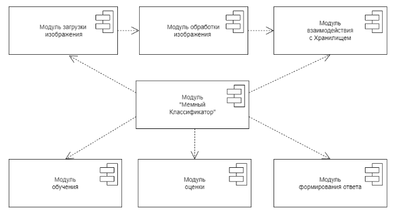

# meme-classifier
Лабораторная работа по курсу "Архитектура систем ИИ"

# Классификатор мемов
-----
### Студент - Расковалова Алёна (P4114)
### Группа - P4141

Ссылка на репозиторий проекта - https://github.com/ResedentSleeper/meme-classifier

#### Цель
Исследовать возможность рекомендаций смешных картинок на основе их классификации

#### Задачи
1. Анализ существующих решений
2. Сбор данных с использованием Python Reddit API Wrapper 
3. Обучение модели на исходном датасете
4. Анализ модели 
5. Оптимизация модели. Дообучение 
6. Развертывание оптимальной модели

#### Датасет

Ссылка на данные https://www.kaggle.com/datasets/gmorinan/memes-classified-and-labelled

Данный датасет содержит 5716 изображений, состоящих из 50 примеров для каждого из 115 классов мемов. Организованы в директории с разделением выборок на train/validation в отношении 20/80. 

Плюс метаданные включающие:  исходную ссылку, оценку, количество комментариев и т. д. для (почти) всех изображений. 

Возможны дублированные изображения, т.к. один и тот же мем был опубликован на двух разных сабреддитах. 

На базе данного датасета предлагается сделать рекомендательную систему с мемами. Данный датасет содержит широкий спектр мемов, хоть большинство из них и на английском. 

Исходный датасет был сокращен до: 
7 классов 
350 изображений 
Средним размером 20 Кбайт
Общим объемом 6,6 Мбайт

#### Пример содержимого датасета

 

#### Демонстрация целесообразности использования выбранного датасета для достижения поставленной цели

Мемы разделены на классы и представлены в равном количестве. Возможен вариант сокращения количества классов. 
Как один из нюансов можно отметить отсутствие некоторых картинок на самом сайте. 

 

#### Описание архитектуры системы 

Диаграмма компонентов
 

Диаграмма активностей системы
 

